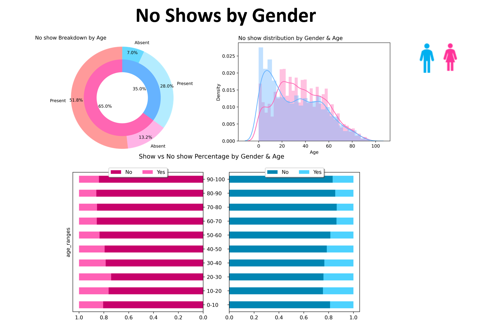
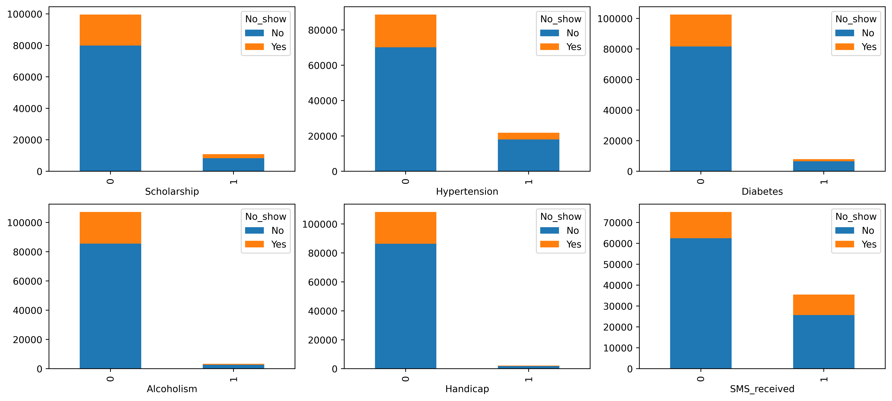
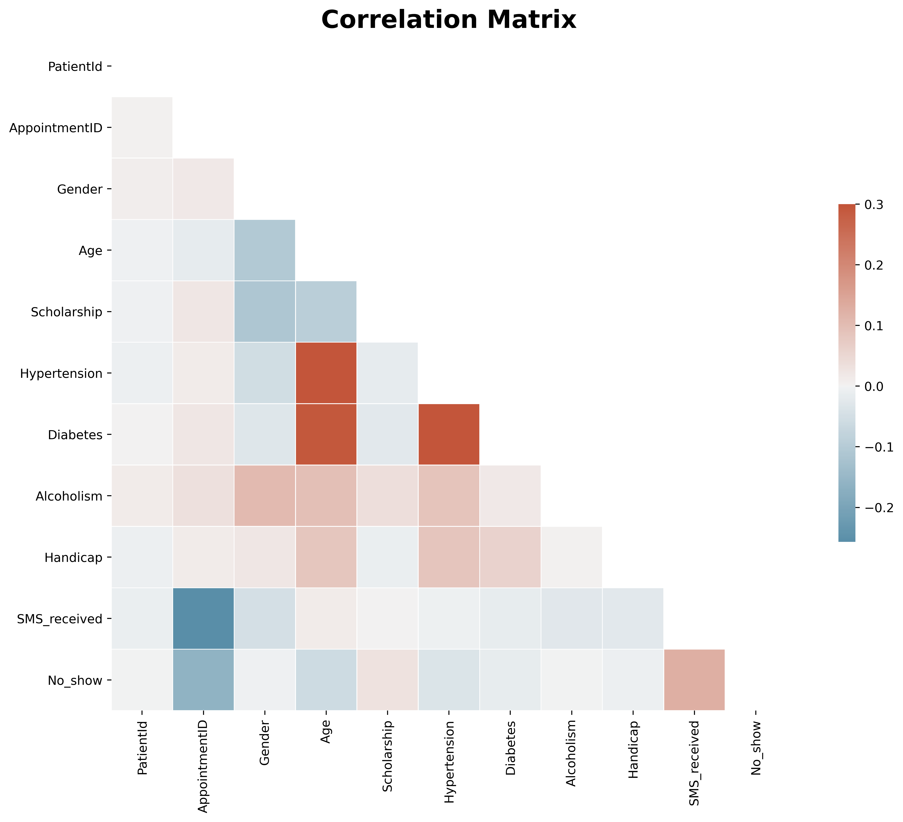
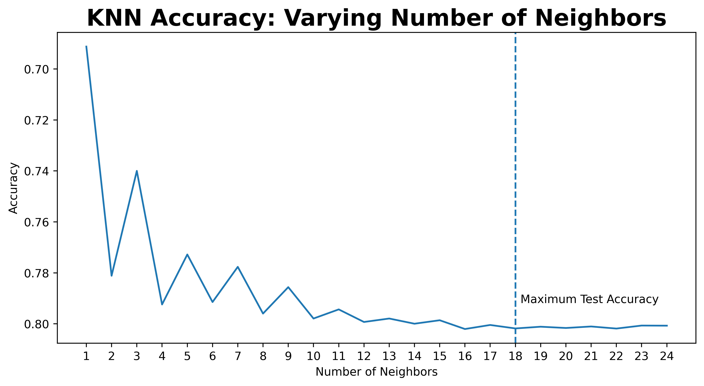
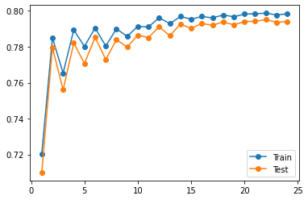
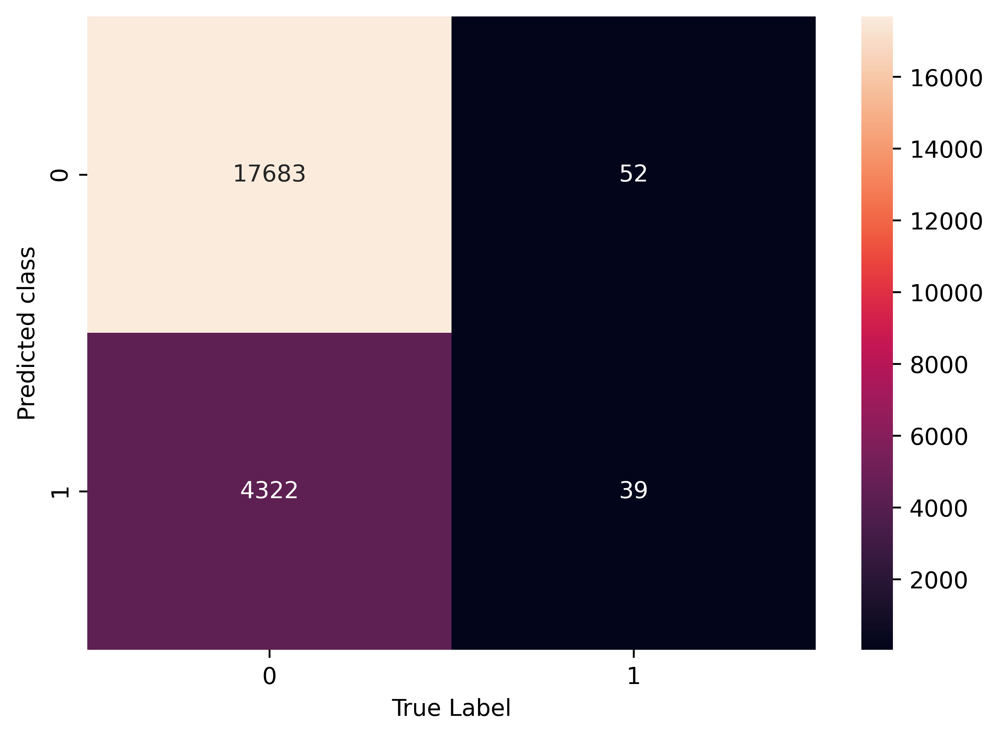

# Patient no show EDA + Visualizaion + Prediction using KNN
 

### Project goal 
---
An American study found that up to 30% of patients missed their appointments and that 150 billion dollars a year was lost due to this. This project aims to analyze the reasons behind missed appointments with data visualizations and identify if any trends are present. 

### Overview 
---
The [Kaggle](https://www.kaggle.com/joniarroba/noshowappointments)  dataset comprised 110k appointments records from public healthcare institutions in a Brazilian city. 
The appointments occurred across a 6-week period in 2016 (27 days ). 
The appointments occurred from 29.4.2016  to 08.06.2016 . the scheduled visits starts  from 10.11.2015 to 8.6.2016.
The data was derived from 62k patients , from 81 neighborhoods. 

**The data consists of the following:**
-	**Identifier**: patient id(non-unique), appointment id ( unique).
-	**Patient information** : gender, the health of the patient (hypertension, diabetes, alcoholism, handicap), scholarship, receiving SMS.
-	**Appointment information**: schedule date (with the time) and appointment date(without the time).
-	**Location of the clinic** : clinic's neighborhood.
-	**Target**: show or no show ( 0 or 1) 

### Data cleaning:
---
Binary coding for the target 0 = show , 1 = no show , gender 0=male , 1 = female .
Ages under 0 were deleted. There is no null data in the dataset.

### Descriptive Statistics
---

**Patients by Gender** 
 
**Figure 1 :** **A**-(counterclockwise) we can see that 65% of the patients are female (the inner circle), 78% of them (51.8% of the data) show up to the appointments, while 22% of them are absent(13.2% of the overall patients).35% of the patients who make appointments are male, 80% of them show up (28.0% of the patients), while 20% of them are absent (7.0%). 
**B-** The distribution of no-shows by age and gender - we can see that in the range 0-10, there is no difference between the rate of no-shows between males and females. However, from the age range of 10-18, the male has more no show, while from the age 18-60, the female has more no show than male.

**C**: Individuals in different age groups exhibit different No-Show behaviors. For example, infants/boys/girls, teenagers, working-age people, and retired populations will all have different No-Show patterns. We can see from this figure that a high rate of females in the age range 20-30 are absent, while there is a high rate of males in the age range of 10-20 who are absent.   

**Show vs. no show by clinic location**  
 

**Figure 2:** we can see here that there is a high rate of absent patients from some of the neighborhoods like nova Palestina.  

**Show vs. no show by other categorical features**  
 

**Figure 3:** This figure shows the no show count for each of the other categorical features  

**Pair plot of Show vs. no show by other categorical features**  
 

**Figure 4:** This Pair plot helps us to understand the best set of features to explain a relationship between two variables or to form the most separated clusters.

**Features correlation**

Before machine learning, we must check if there is a correlation between the features. In the figure below, we can see that there is no high correlation between the features.  

 
---

### Machine learning  
---
#### Model selection and evaluation  
This is a binary classification problem, so I will be using KNN Classifier. Features like Patient id, appointment id, and the neighborhood were dropped (because there are 81 neighborhoods and there will be many features, and it may be cause overfitting).

#### Step 1 :  

**The dataset was split into 80 % of the appointments, with a 20% test data set.** 

Using five cross-validation folds, the data was fitted on KNN Classifier using RandomizedSearchCV. With this we found the best KNN as 18 with an accurancy of approximately 80%. 

#### Step 2 :  

We then looped through for various K values and plotted the K elbow graph which shows us that as K or Number of neighbors increases, the accuracy increases until it reaches an optimal point. 

 
**Figure 5:** This plot looks like an arm with a clear elbow at k =18

#### Step 3 :  

We then ran a comparision to Evaluate KNN Performance on train and test sets with different numbers of neighbors.

 
**Figure 6:** As you can see here, the train and test performance was almost similar.
We can then conclude that 
- KNN classifier does not have any specialized training phase as it uses all the training samples for classification and simply stores the results in memory.
- KNN is a non-parametric algorithm because it does not assume anything about the training data. This makes it useful for problems having non-linear data.
- KNN can be computationally expensive both in terms of time and storage, if the data is very large because KNN has to store the training data to work. This is generally not the case with other supervised learning models.
- KNN can be very sensitive to the scale of data as it relies on computing the distances. For features with a higher scale, the calculated distances can be very high and might produce poor results. It is thus advised to scale the data before running the KNN.

#### Step 3 :  

 

**Figure 7:** From the Confusion Matrix we can see that most of our errors were where the model predicted a patient to show when they did not.

### Conclusion :
---
In conclusion, it seems that no-shows can be predicted from patient information and appointment data. More information about the clinic’s location (e.g., transport accessibility), type of care sought (e.g., primary, specialist), and the patient (e.g., education, income) would likely improve the model. The model could also benefit from a cost-benefit analysis of possible intervention measures to achieve a balance of precision and recall that would make the most business sense.
-	Patients with a high number of previous No-Shows are more likely to No Show in future appointments.
-	 Patients in different age groups exhibit different No-Show behaviors, as shown in figure 1.
-	The neighborhood's location may affect the patients to decide whether they show up for their medical appointments; as shown in figure 2, some neighborhoods have a high rate of absent patients.
-	SMS could be a helpful way to remind patients of their appointments, and we can see that many patients did not receive an SMS.  

**Recommendations to improve the attendance:** 
-   Perform feature engineering by developing parameters such as Waiting Days, Disease Breakdown, Total Prior Appointments etc.
-	sending the SMS notification to every patient who made an appointment.
-	Trying to make the appointment as quickly as possible, limit to less than 15 days.
-	Call the patients who received the SMS and missed up their appointment.

 **Limitation:** 
-	We were given only a snapshot of complete data (from one month). Therefore, making exact predictions and analyses on snapshot data is difficult, and the analysis might not represent the actual data.
-	The Time details in the Appointment Day were missing, which would help us predict No Show of a patient.
-	The reason for the appointment and the consultation doctor specialization would have helped us a lot in making better analyses and predictions for the No Show of a patient.

